# 🔒 密码保护文章功能

Fuwari 博客支持文章密码保护功能，允许你创建需要密码才能查看的私密文章。这个功能完全基于前端加密实现，符合静态网站的特性。

## ✨ 功能特性

- 🔐 **AES-256-CBC 加密**: 使用现代加密算法保护文章内容
- 🌟 **静态部署友好**: 无需后端服务，完全在浏览器端工作
- 🎨 **主题兼容**: 完美适配明暗主题切换
- 📱 **响应式设计**: 支持各种设备屏幕尺寸
- 🔍 **可视化标识**: 在文章列表中显示🔒图标标识
- ⚡ **无缝体验**: 解锁后立即显示内容，无需刷新页面
- 🔄 **密码缓存**: 自动记住已解锁文章，30天内无需重新输入密码

## 🚀 快速开始

### 创建密码保护文章

在文章的 frontmatter 中添加 `password` 字段：

```markdown
---
title: 我的私密文章
published: 2025-05-29
description: '这是一篇受密码保护的文章'
tags: [私密, 个人]
category: '日记'
password: mysecretpassword
---

# 这是受保护的内容

只有输入正确密码的用户才能看到这些内容...
```

### 生成安全密码

使用内置的密码生成工具：

```bash
# 生成默认12位密码
pnpm generate-password

# 生成16位密码
pnpm generate-password -l 16

# 生成包含特殊符号的密码
pnpm generate-password -s

# 生成20位包含符号的强密码
pnpm generate-password -l 20 -s
```

## 🔧 技术实现

### 加密流程

1. **内容获取**: 使用 Astro Slots API 获取文章 HTML 内容
2. **加密处理**: 在构建时使用 AES-256-CBC 算法加密内容
3. **存储方式**: 加密后的内容以 Base64 格式存储在页面的 meta 标签中
4. **解密显示**: 用户输入密码后，在浏览器端解密并替换页面内容

### 核心组件

```
src/
├── components/
│   ├── PasswordWrapper.astro    # 密码包装器组件
│   └── PasswordUnlock.astro     # 密码解锁界面
├── utils/
│   └── password-encrypt-utils.ts # 加密解密工具
└── content/
    └── config.ts               # Content Collection 配置
```

### 密码验证流程

```mermaid
graph TD
    A[用户访问文章] --> B{是否有密码保护?}
    B -->|否| C[直接显示内容]
    B -->|是| D[显示密码输入界面]
    D --> E[用户输入密码]
    E --> F[前端解密]
    F --> G{解密成功?}
    G -->|是| H[显示文章内容]
    G -->|否| I[显示错误提示]
    I --> E
```



## 🎨 界面定制

### 自定义密码输入界面

密码输入界面的样式可以通过修改 `src/components/PasswordUnlock.astro` 来定制：

```astro
<!-- 自定义样式示例 -->
<div class="password-input-wrapper custom-style">
    <div class="custom-icon">🔐</div>
    <h3 class="custom-title">请输入访问密码</h3>
    <!-- ... 其他元素 -->
</div>
```

### 自定义密码图标

可以修改文章列表中的密码保护标识，在 `PostCard.astro` 中：

```astro
{password && <Icon name="material-symbols:lock" class="ml-2 text-[var(--primary)]" />}
```

## ⚠️ 安全注意事项

### 安全级别

这个密码保护功能提供的是**基础级别**的内容保护，适用于以下场景：

✅ **适合的用途:**
- 博客日记的隐私保护
- 限制访问的技术文档
- 朋友圈内容分享
- 草稿文章的临时保护

❌ **不适合的用途:**
- 高度敏感的商业信息
- 个人隐私数据
- 法律相关文档
- 金融信息

### 安全限制

1. **客户端加密**: 加密和解密都在浏览器端进行，理论上可以被绕过
2. **密码存储**: 加密内容存储在静态文件中，可以被下载分析
3. **暴力破解**: 没有限制密码尝试次数的机制
4. **网络传输**: 密码通过前端 JavaScript 处理，可能在开发者工具中被观察到
5. **本地存储**: 解锁的密码以明文形式存储在浏览器本地，共享设备时需注意

### 最佳实践

1. **使用强密码**: 建议使用 12 位以上的复杂密码
2. **定期更换**: 对于敏感内容，建议定期更换密码
3. **访问控制**: 只与信任的人分享密码
4. **备份策略**: 保存好密码，避免丢失导致内容无法访问
5. **公共设备**: 在公共设备上浏览后，记得清除浏览器数据以移除密码缓存

## 🛠️ 故障排除

### 常见问题

**Q: 输入正确密码后显示"密码错误"**
A: 检查密码是否包含特殊字符，确保 frontmatter 中的密码格式正确。

**Q: 加密内容在构建后显示异常**
A: 确保文章内容不包含会破坏 HTML 结构的特殊字符。

**Q: 解锁后页面样式丢失**
A: 这可能是由于内容中包含了样式相关的代码，检查文章内容的 HTML 结构。

**Q: 如何清除已保存的密码缓存？**
A: 可以通过浏览器的开发者工具清除localStorage，或在控制台执行以下命令：
```javascript
// 清除所有密码缓存
Object.keys(localStorage).forEach(key => {
  if (key.startsWith('fuwari-')) localStorage.removeItem(key);
});
```

### 调试模式

在开发环境中，可以通过浏览器控制台查看加密相关的调试信息：

```javascript
// 在浏览器控制台中查看加密内容
console.log(document.querySelector('meta[name="encrypted-content"]').content);
```

## 📝 更新日志

### v1.1.0 (2025-05-29)
- ✨ 添加密码缓存功能
- 🔄 支持30天内自动解锁
- 🔒 改进安全性与过期清理
- 🎨 使用Material Icons替换emoji图标

### v1.0.0 (2025-05-28)
- ✨ 初始版本发布
- 🔐 支持 AES-256-CBC 加密
- 🎨 密码输入界面设计
- 🔍 文章列表密码标识
- 🛠️ 密码生成工具

## 🤝 贡献指南

如果你想改进这个功能，欢迎提交 Pull Request：

1. Fork 本仓库
2. 创建功能分支: `git checkout -b feature/password-enhancement`
3. 提交更改: `git commit -am 'Add new password feature'`
4. 推送分支: `git push origin feature/password-enhancement`
5. 创建 Pull Request

## 📄 许可证

本功能遵循项目的整体许可证。